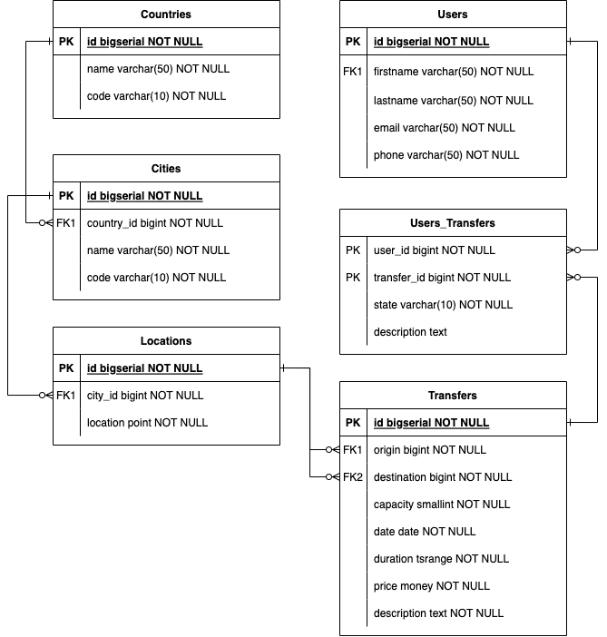

### INTRODUCTION

The purposes of this research are next:
1. Compare the performance of most commonly used frameworks, languages, and libraries;
2. Gain the experience in different non-related to previous primary focused stack, be hands-on with neighbor technologies;
3. Share results with the global community all over the world;

### COMMON INFORMATION

* I disabled all application levels caches to get clear performance metrics of the server as it is;
* The database and application are running in the same network to avoid net lags and penalties;
* The average time to boot up the service will not depend on the database structure due to the fact that I am not using any database migration tools such as [Flyway](https://flywaydb.org/) or [Liquibase](https://www.liquibase.org/);
* All database structures had been already prepared and filled with faked data;
* As a load testing tool I chose [Gatling](https://gatling.io/);
* The versions of all languages, frameworks, libraries, and databases are the latest LTS at the moment of testing.

### DATABASE STRUCTURE

### DATASET DESCRIPTION

The definition of database [init scrip](./database/docker/database_definition.sql) and [docker-compose](./database/docker/docker-compose.yml) file.

To connect via pgadmin follow [pgadmin](localhost:5050) enter "user@user.com" and "password".
Create server and attach to host `docker inspect $(docker ps -aqf "name=postgres") | grep IPAddress`, port 5432, db "postgres" with "user" and "password" credentials.

|       UNIT      | AMOUNT |
|:----------------|:-------|
| Countries       | 1      |
| Cities          | 6      |
| Locations       | 100    |
| Transfers       | 15000  |
| Users           | 200000 |
| Users_Transfers | 500000 |

Database size: ? MB

Database dump size: ? MB

Docker image with predefined data: ? MB

### USE CASES

| #    | Scenario step          | Assumed operation           |
| :--: | :--------------------- | :-------------------------- |
| 1    | As a user I would like to choose the origin. | [GET] The list of available origins is presented. |
| 2    | As a user I would like to choose the destination. | [GET] The list of available destinations except the origin is presented.  |
| 3    | As a user I would like to choose the date of transfer. | [GET] [NO LOAD] The future dates for the current month are presented. |
| 4    | As a user I would like to see all available transfers and their common information for this date. | [GET] The list of available transfers by selected origin, destination, and date is presented. |
| 5    | As a user I would like to book the cheapest transfer. | [POST] The cheapest transfer is booked in the system. |
| 6    | As a user I would like to see all my transfers. | [GET] The list of all my transfers (COMPLETED, CANCELED, BOOKED) is presented. |
| 7    | As a user I would like to view any owned transfer. | [GET] One of the transfers (COMPLETED, CANCELED, BOOKED) is retrieved. |
| 8    | As a user I would like to edit any owned transfer in the future. | [PUT] Any (BOOKED) transfer description is updated. |
| 9    | As a user I would like to cancel any owned transfer in the future. | [PUT] Any (BOOKED) transfer is canceled (CANCELED).  |
| 10   | As a user I would like to complete any owned transfer in the past. | [PUT] Any (BOOKED) transfer is completed (COMPLETED).  |
| 11   | Repeat (1) - (9) every 4 hours for each user. | |

The application is a transportation service.

Let's assume that the average user has the biggest interest to book the transfer from 8:00 till 00:00.
As a result, we will have 16 per day and 112 hours of load per week.

### RESULTS

* [SPRING BOOT WEB](spring-boot-web/README.md)
* [SPRING BOOT WEB NATIVE](spring-boot-web-native/README.md)
* [SPRING BOOT REACTIVE](spring-boot-reactive/README.md)
* [SPRING BOOT REACTIVE NATIVE](spring-boot-reactive-native/README.md)

### SUPPORT THE PROJECT

* TON: EQB3lxe8IlUGocilOCzuFhALm71XElZjcyJoFl08Tupx6lfe
* BTC: 35ruuFbGjjsh4fed32hZKTAaLzVb3q7KjX
* ETH: 0x7a19d2e4e978e473f3c3d762d097f94e8a546eef