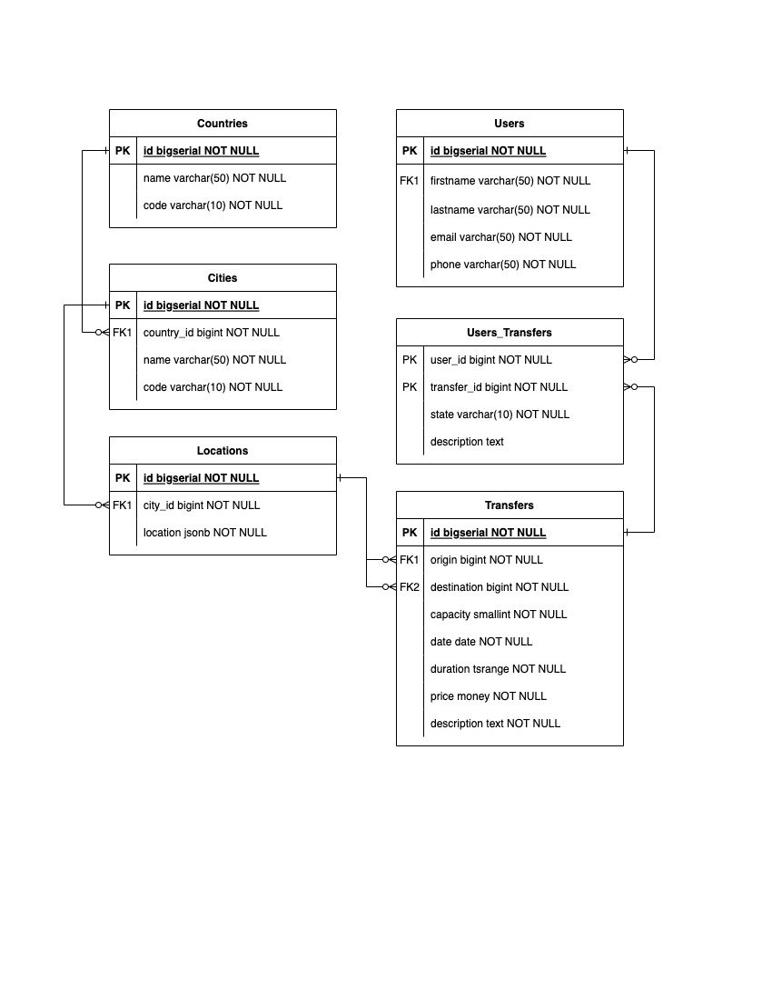

### INTRODUCTION

The purposes of this research are next:
1. Compare the performance of most commonly used frameworks, languages, and libraries;
2. Gain the experience in different non-related to previous primary focused stack, be hands-on with neighbor technologies;
3. Share results with the global community all over the world;

------------------------------------------------------------------------------------------------------------------------

### COMMON INFORMATION

* I disabled all application levels caches to get clear performance metrics of the server as it is;
* The database and application are running in the same network to avoid net lags and penalties;
* The fetching strategy is `EAGER`. First, to do a higher load and non-optimized queries to database. Second, not to spend time to setup entity graphs.
* The average time to boot up the service will not depend on the database structure due to the fact that I am not using any database migration tools such as [Flyway](https://flywaydb.org/) or [Liquibase](https://www.liquibase.org/);
* All database structures had been already prepared and filled with faked data;
* As a load testing tool I chose [Gatling](https://gatling.io/);
* The versions of all languages, frameworks, libraries, and databases are the latest LTS at the moment of testing.

------------------------------------------------------------------------------------------------------------------------

### DATABASE STRUCTURE

------------------------------------------------------------------------------------------------------------------------

### DATASET DESCRIPTION

The definition of database [init script](./env/database/docker/database_definition.sql) and [docker-compose](./env/database/docker/docker-compose.yml) file.

To connect via pgadmin follow [pgadmin](localhost:5050) enter "user@user.com" and "password".
Create server and attach to host `docker inspect $(docker ps -aqf "name=postgres") | grep IPAddress`, port "5433", db "postgres" with "user" and "password" credentials.

|       UNIT      | AMOUNT |
|:----------------|:-------|
| Countries       | 1      |
| Cities          | 6      |
| Locations       | 120    |
| Transfers       | 12000  |
| Users           | 200000 |
| Users_Transfers | 500000 |

For a generation of the dataset, I've created the other module [datagen](./datagen). I will not dive deeper into data generation process.
You could easily check out how it works in sources. After that, I got DB size, and DB dump, and created a separate docker image with the predefined dataset.
This docker image is located in every tested module directory.

The DB metrics:

* Database size: 153 MB
* Database dump size: 130.8 MB
* Docker image with predefined data: 160.01 MB

------------------------------------------------------------------------------------------------------------------------

### USE CASES

| #    | Scenario step          | Assumed operation           |
| :--: | :--------------------- | :-------------------------- |
| 1    | As a user I would like to choose the country. | [GET] The list of available countries is presented. |
| 2    | As a user I would like to choose the city. | [GET] The list of available cities is presented. |
| 3    | As a user I would like to choose the origin. | [GET] The list of available origins is presented. |
| 4    | As a user I would like to choose the destination. | [GET] The list of available destinations is presented.  |
| 5    | As a user I would like to choose the date of transfer. | [GET] [NO LOAD] The future dates for the current month are presented. |
| 6    | As a user I would like to see all available transfers from 'origin', to 'destination' for selected this date. | [GET] The list of available transfers by selected origin, destination, and date is presented. |
| 7    | As a user I would like to book a transfer. | [POST] The transfer is booked in the system. |
| 8    | As a user I would like to see all my transfers. | [GET] The list of all my transfers (COMPLETED, CANCELED, BOOKED) is presented. |
| 9    | As a user I would like to view any owned transfer. | [GET] One of the transfers (COMPLETED, CANCELED, BOOKED) is retrieved. |
| 10   | As a user I would like to edit any owned transfer in the future. | [PUT] Any (BOOKED) transfer description is updated. |
| 11   | As a user I would like to cancel any owned transfer in the future. | [PUT] Any (BOOKED) transfer is canceled (CANCELED).  |
| 12   | As a user I would like to complete any owned transfer in the past. | [PUT] Any (BOOKED) transfer is completed (COMPLETED).  |
| 13   | As a user I would like to see my profile. | [GET] User is retrieved with her/his transfers data. |
| 14   | As a user I would like to update my profile. | [PUT] User updates with her/his own data. |
| 15   | Repeat (1) - (9) 20 minutes for each user. | |

The application is a transportation service.

Let's assume that the average user has the biggest interest to book the transfer from 8:00 till 00:00.
As a result, we will have 16 per day and 112 hours of load per week.

I've described all use cases endpoints via [OpenAPI](./env/api/a2b.yaml).

------------------------------------------------------------------------------------------------------------------------

### RESULTS

|APPLICATION TYPE|BUILD TYPE        |BUILD TIME (s)|ARTIFACT SIZE (MB)|BOOT UP (s)|ACTIVE USERS|TOTAL REQUESTS|OK     |KO(%)|RPS    |RESPONSE TIME (95th pct) (ms)|SATURATION POINT|RAM (MB)|CPU (%) |THREADS (MAX)|POSTGRES CPU (%)|
|:---------------|:-----------------|:-------------|:-----------------|:----------|:-----------|:-------------|:------|:----|:------|:----------------------------|:---------------|:-------|:-------|:------------|:---------------|
|WEB             |BUILD PACK        |751           |144,79            |1,585      |10201       |453012        |339759 |25   |374.566|47831                        |584             |310     |12,5    |64           |99              |
|WEB             |NATIVE BUILD TOOLS|210           |116,20            |0,310      |8759        |480763        |342782 |29   |414.785|32175                        |1829            |:white_check_mark: 263     |:white_check_mark: 8       |52           |99              |
|WEB             |UNDERTOW          |5             |49,70             |3,59       |10311       |523756        |396071 |24   |381.127|50977                        |1611            |658     |11      |33           |99              |
|WEB             |UNDERTOW IN DOCKER|46            |280               |5,20       |10264       |430673        |289692 |33   |448.682|29998                        |916             |840     |15      |32           |99              |
|REACTIVE        |BUILD PACK        |1243          |98,5              |:white_check_mark: 0,103|10268       |691487        |573983 |17   |615.75	|17891                        |1904            |685     |30      |:white_check_mark: 14           |:white_check_mark: 70              |
|REACTIVE        |NATIVE BUILD TOOLS|187           |71,7              |:white_check_mark: 0,107|10224       |1013549       |915094 |10   |934.147|12591                        |3038            |634     |32      |23           |:white_check_mark: 70              |
|REACTIVE        |JAR               |:white_check_mark: 3,1|:white_check_mark: 40,6|2,55       |10326       |:white_check_mark: 1168782       |1079847|:white_check_mark: 8    |:white_check_mark: 1091,3 |:white_check_mark: 10406                        |:white_check_mark: 4391            |1823    |:white_check_mark: 8       |31           |:white_check_mark: 70              |
|REACTIVE        |JAR IN DOCKER     |39            |271               |3,95       |10258       |699180        |581761 |17   |631.599|18955                        |2250            |883     |29      |31           |:white_check_mark: 70              |

* [SPRING WEB AND SPRING WEB AS NATIVE](https://github.com/fragaLY/blog/blob/main/spring-boot-web_vs_spring-boot-web-native/SPRING-BOOT-WEB_VS_SPRING-BOOT-WEB-NATIVE.md)
* [SPRING REACTIVE AND SPRING REACTIVE AS NATIVE](https://github.com/fragaLY/blog/blob/main/spring-boot-reactive_vs_spring-boot-reactive-native/SPRING-BOOT-REACTIVE_VS_SPRING-BOOT-REACTIVE-NATIVE.md)
* [QUARKUS REACTIVE AND QUARKUS REACTIVE AS NATIVE](https://github.com/fragaLY/blog/blob/main/quarkus-reactive_vs_quarkus-reactive-native/QUARKUS-REACTIVE_VS_QUARKUS-REACTIVE-NATIVE.md)

------------------------------------------------------------------------------------------------------------------------

### SUPPORT THE PROJECT

* TON: EQB3lxe8IlUGocilOCzuFhALm71XElZjcyJoFl08Tupx6lfe
* BTC: 35ruuFbGjjsh4fed32hZKTAaLzVb3q7KjX
* ETH: 0x7a19d2e4e978e473f3c3d762d097f94e8a546eef
