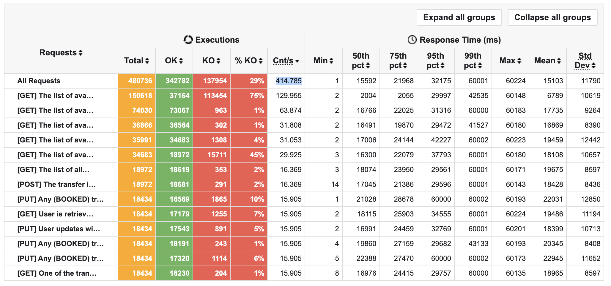
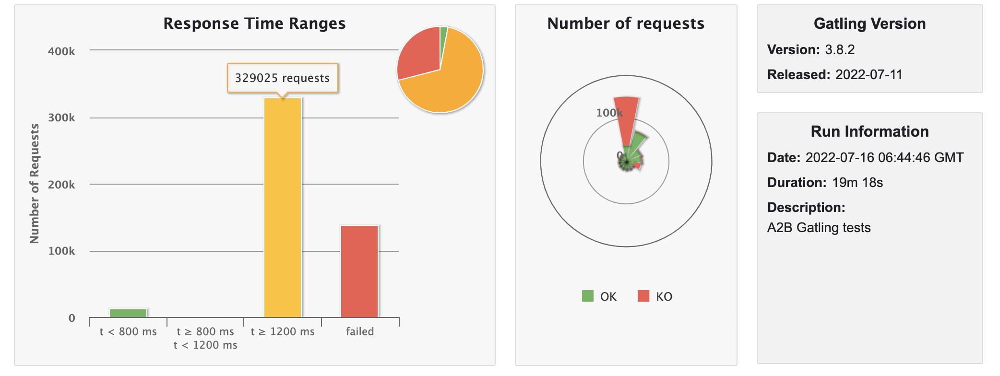
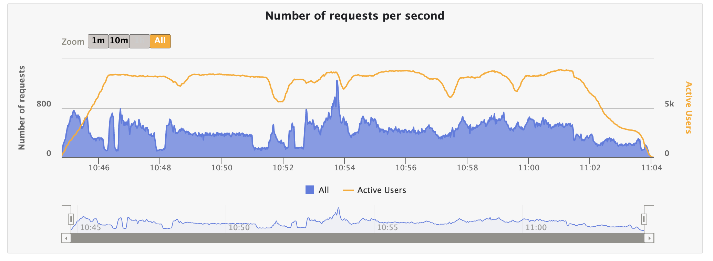
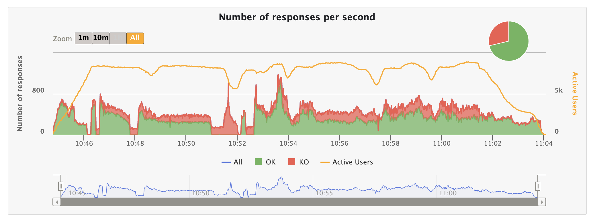
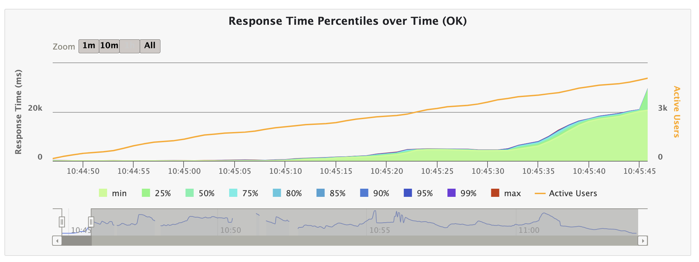
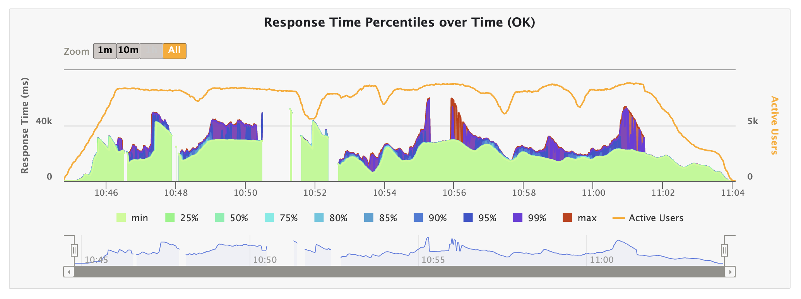
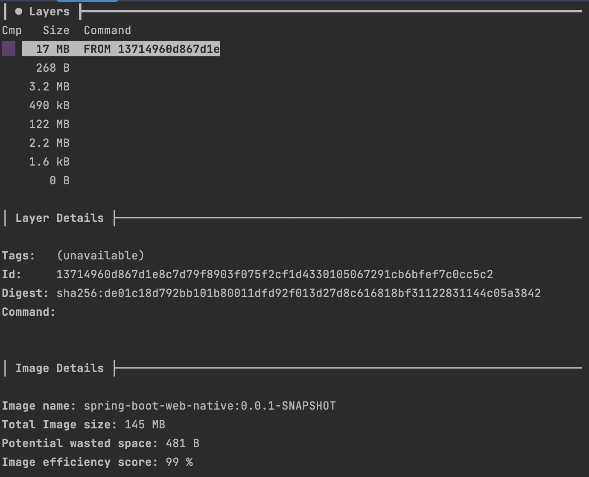

### SPRING BOOT WEB NATIVE PERFORMANCE REPORT

> Model Name: MacBook Pro

> Model Identifier: MacBookPro16,2

> Processor Name: Quad-Core Intel Core i7

> Processor Speed: 2,3 GHz

> Number of Processors: 1

> Total Number of Cores: 4

> L2 Cache (per Core): 512 KB

> L3 Cache: 8 MB

> Hyper-Threading Technology: Enabled

> Memory:	32 GB

#### Base Setup

|JDK|GC|Gradle|Spring Boot|Spring AOT|
|:--|:-|:-----|:----------|:---------|
|17 |G1|7.5   |2.7.1      |0.12.1    |

####  OVERALL

|TYPE              |BUILD TIME (s)|ARTIFACT SIZE (MB)|BOOT UP (s)|ACTIVE USERS|RPS    |RESPONSE TIME (95th pct) (ms)|SATURATION POINT|RAM (MB)| CPU (%)|THREADS (MAX)|POSTGRES CPU (%)|
|:-----------------|:-------------|:-----------------|:----------|:-----------|:------|:----------------------------|:---------------|:-------|:-------|:------------|:---------------|
|BUILD PACK        |751           |144,79            |:white_check_mark: 0,285|:white_check_mark: 10201|374.566|47831|584             |310     |12,5    |64           |99              |
|NATIVE BUILD TOOLS|:white_check_mark: 210|116,20    |0,310      |8759        |:white_check_mark: 414.785|:white_check_mark: 32175|:white_check_mark: 1829|:white_check_mark: 263|:white_check_mark: 8|:white_check_mark: 52|99              |

* TOMCAT

``` yaml
server:
  compression:
    enabled: true
  tomcat:
    threads:
      max: 32
      min-spare: 4

```

------------------------------------------------------------------------------------------------------------------------



------------------------------------------------------------------------------------------------------------------------



------------------------------------------------------------------------------------------------------------------------



------------------------------------------------------------------------------------------------------------------------



------------------------------------------------------------------------------------------------------------------------



------------------------------------------------------------------------------------------------------------------------



------------------------------------------------------------------------------------------------------------------------



------------------------------------------------------------------------------------------------------------------------

[Performance Tests Results](./static/native.zip)