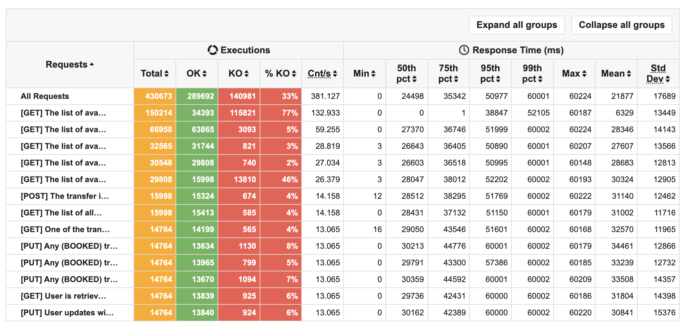
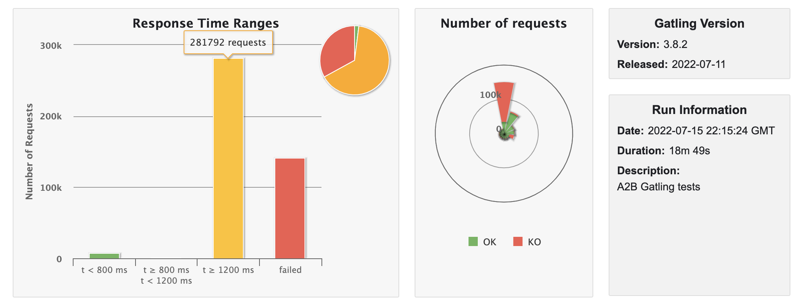
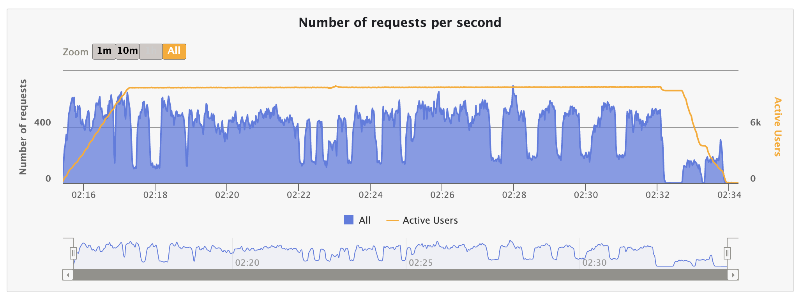
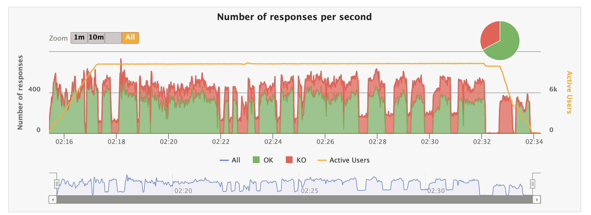
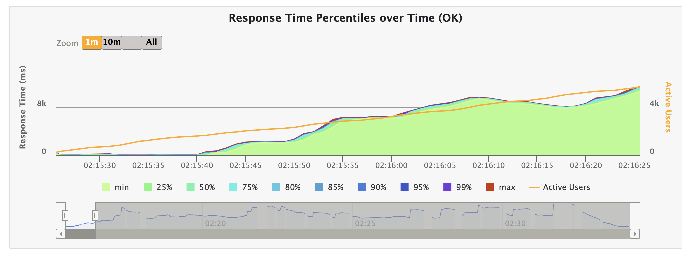
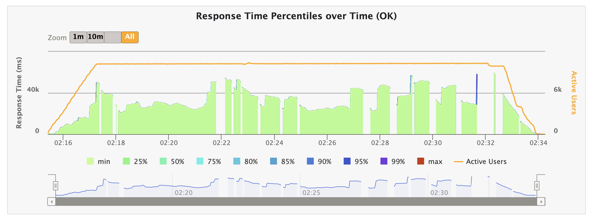
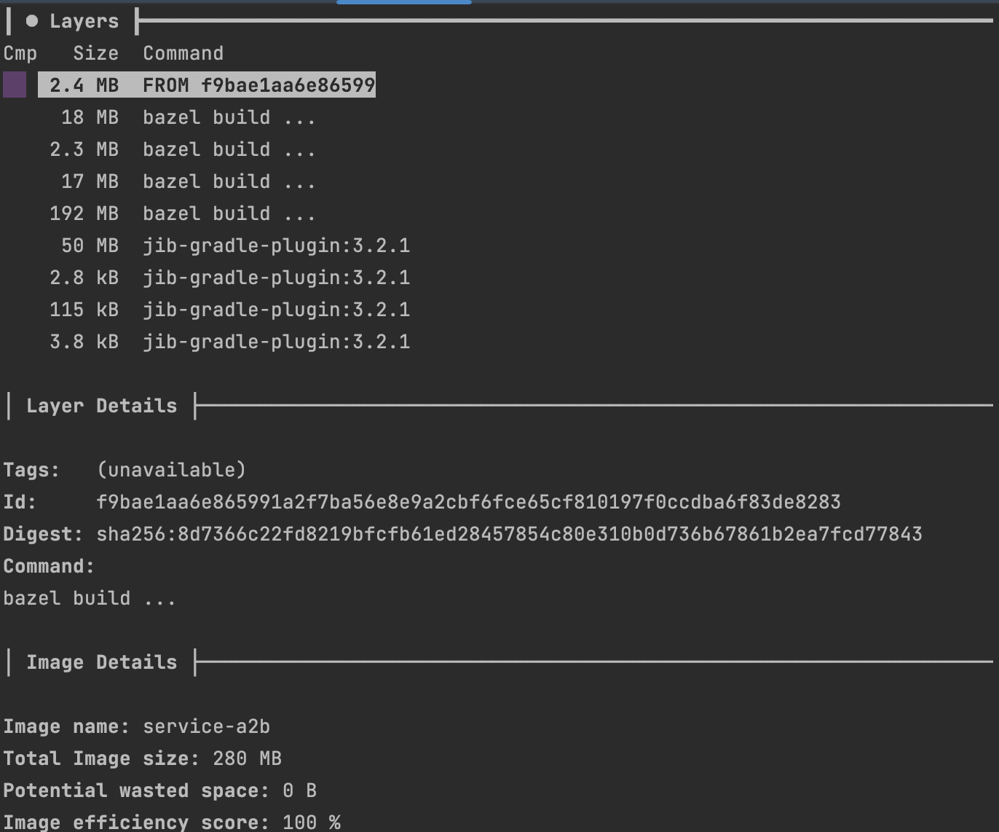

### SPRING BOOT WEB PERFORMANCE REPORT

> Model Name: MacBook Pro

> Model Identifier: MacBookPro16,2

> Processor Name: Quad-Core Intel Core i7

> Processor Speed: 2,3 GHz

> Number of Processors: 1

> Total Number of Cores: 4

> L2 Cache (per Core): 512 KB

> L3 Cache: 8 MB

> Hyper-Threading Technology: Enabled

> Memory:	32 GB

#### BASE SETUP

|JDK|GC|Gradle|Spring Boot|
|:--|:-|:-----|:----------|
|17 |G1|7.5   |2.7.1      |

####  OVERALL

Average build time between 5-6 seconds.

|TYPE    |BUILD TIME (s)|ARTIFACT SIZE (MB)|BOOT UP (s)|ACTIVE USERS|RPS    |RESPONSE TIME (95th pct) (ms)|SATURATION POINT|JVM HEAP (MB)|JVM NON-HEAP (MB)|JVM CPU (%)|THREADS (MAX)|POSTGRES CPU (%)|
|:-------|:-------------|:-----------------|:----------|:-----------|:------|:----------------------------|:---------------|:------------|:----------------|:----------|:------------|:---------------|
|TOMCAT  |N/A           |N/A               |3,94       |8168        |418,715|:white_check_mark: 29289     |1568            |:white_check_mark: 365|94      |12         |226          |99              |
|JETTY   |N/A           |N/A               |3,83       |10201       |:white_check_mark: 421.816|54207     |1592            |1137         |94               |14         |224          |99              |
|UNDERTOW|:white_check_mark: 5|49,70|:white_check_mark: 3,59|:white_check_mark: 10311|381.127|50977|:white_check_mark: 1611|658   |94               |:white_check_mark: 11|:white_check_mark: 33|99|
|UNDERTOW IN DOCKER|6    |                 |            |

------------------------------------------------------------------------------------------------------------------------

* TOMCAT

``` yaml
server:
  compression:
    enabled: true
  tomcat:
    accept-count: 100 # default: 100
    threads:
      max: 200 # default: 200
      min-spare: 10 # default: 10

```

 

------------------------------------------------------------------------------------------------------------------------

* JETTY

``` yaml
server:
 compression:
   enabled: true
 jetty:
   threads:
     max: 200 # default: 200
     min: 8 # default: 8

```

 

------------------------------------------------------------------------------------------------------------------------

* UNDERTOW

``` yaml
server:
 compression:
   enabled: true
 undertow:
   threads:
     io: 4 # default: equals to cores count
     worker: 8 # default: 8

```

------------------------------------------------------------------------------------------------------------------------



------------------------------------------------------------------------------------------------------------------------



------------------------------------------------------------------------------------------------------------------------



------------------------------------------------------------------------------------------------------------------------



------------------------------------------------------------------------------------------------------------------------



------------------------------------------------------------------------------------------------------------------------



------------------------------------------------------------------------------------------------------------------------



------------------------------------------------------------------------------------------------------------------------

[Performance Tests Results](./static/web.zip)