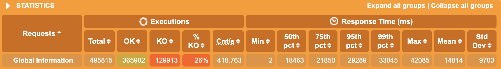

### SPRING BOOT WEB PERFORMANCE REPORT

`Model Name: MacBook Pro
Model Identifier: MacBookPro16,2
Processor Name: Quad-Core Intel Core i7
Processor Speed: 2,3 GHz
Number of Processors: 1
Total Number of Cores: 4
L2 Cache (per Core): 512 KB
L3 Cache: 8 MB
Hyper-Threading Technology: Enabled
Memory:	32 GB`

* Base Setup

|JDK|GC|Gradle|Spring Boot|
|:--|:-|:-----|:----------|
|17 |G1|7.4.1 |2.7.0      |

* OVERALL

Average build time between 5-6 seconds.

|SERVER  |BOOT UP (s)|ACTIVE USERS|RPS    |SATURATION POINT|JVM HEAP (MB)|JVM NON-HEAP (MB)|JVM CPU (%)|THREADS (MAX)|POSTGRES CPU (%)|
|:-------|:----------|:-----------|:------|:---------------|:------------|:----------------|:----------|:------------|:---------------|
|TOMCAT  |3,94       |8168        |418,715|1568            |:white_check_mark: 365          |94               |12         |226          |99              |
|JETTY   |3,83       |10201       |421.816|1662            |1137         |94               |14         |224          |99              |
|UNDERTOW|:white_check_mark: 3,59       |:white_check_mark: 10221       |:white_check_mark: 426.859|:white_check_mark: 1709            |658          |94               |:white_check_mark: 11         |:white_check_mark: 33           |99              |

* TOMCAT

``` yaml
server:
  compression:
    enabled: true
  tomcat:
    accept-count: 100 # default: 100
    threads:
      max: 200 # default: 200
      min-spare: 10 # default: 10

```

 

* JETTY

``` yaml
server:
 compression:
   enabled: true
 jetty:
   threads:
     max: 200 # default: 200
     min: 8 # default: 8

```

 

* UNDERTOW

``` yaml
server:
 compression:
   enabled: true
 undertow:
   threads:
     io: 4 # default: equals to cores count
     worker: 8 # default: 8

```

 